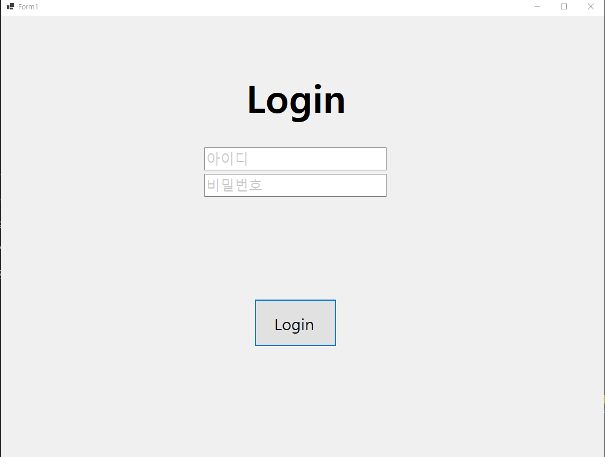
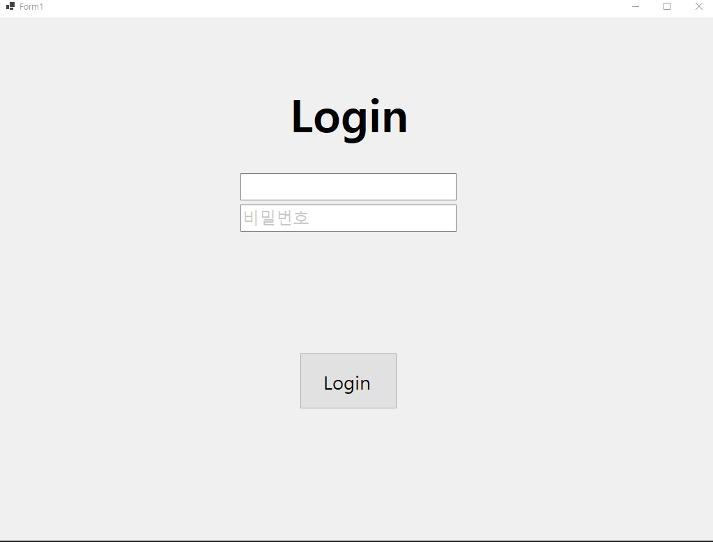
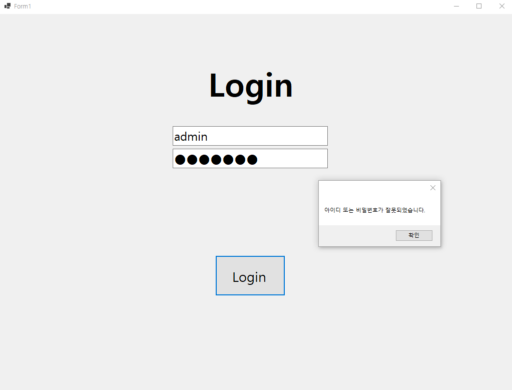
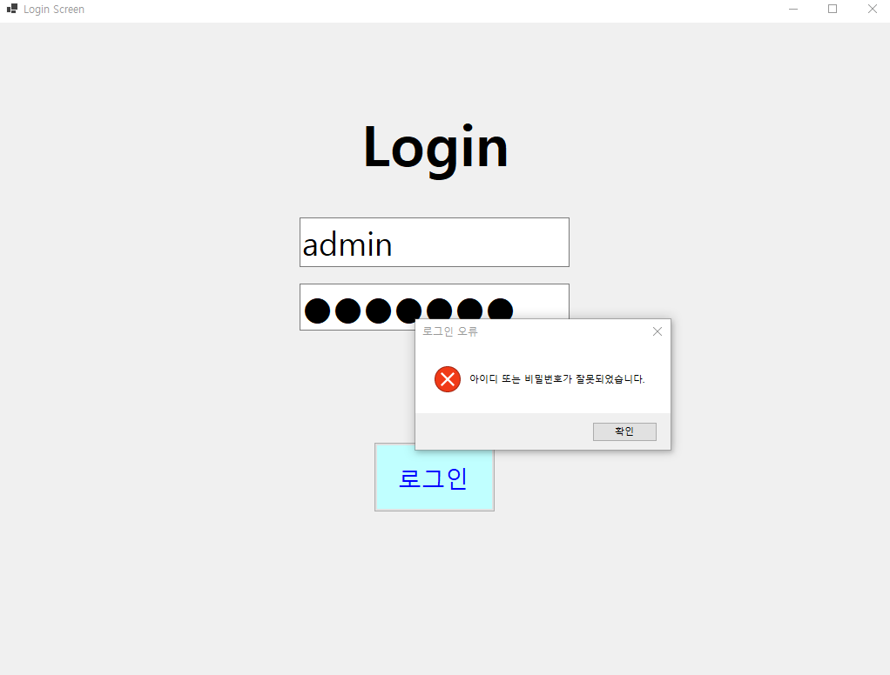

# (C# 코딩) 로그인 화면

## 개요

  - C\# 프로그래밍 학습
  - 1줄 소개:
    사용자 인증의 기본인 아이디/비밀번호를 입력받아 검증하는 프로그램
  - 사용한 플랫폼:
    C#, .NET Windows Forms, Visual Studio
  - 사용한 컨트롤:
    `TextBox`(`txtID`, `txtPW`), `Button`(`btnLogin`), `Label`(`lblAppname`)
  - 사용한 기술과 구현한 기능:
      - **이벤트 기반 Placeholder**: `Enter`와 `Leave` 이벤트를 활용한 힌트 텍스트 제어
      - **보안 텍스트 처리**: `UseSystemPasswordChar` 속성을 이용한 비밀번호 마스킹
      - **조건부 인증**: 논리연산자(`&&`)를 이용한 아이디/비밀번호 동시 일치 여부 확인
      - **사용자 피연산자 제어**: 성공/실패 여부에 따른 `MessageBox` 피드백 제공

-----

## 실행 화면 (과제 1)

  - **과제 내용**

      - 기본적인 로그인 UI(아이디, 비밀번호, 버튼)를 배치하고 속성을 설정합니다.
      - 아이디와 패스워드가 미리 지정된 값(`myID : admin`, `myPW : password`)과 일치할 때만 로그인을 허용하는 로직을 구현합니다.
      - 사용자가 입력창을 클릭하거나 벗어날 때 힌트 텍스트가 나타나고 사라지는 시각적 효과를 추가합니다.

  - **구현 내용과 기능 설명**

      - **동적 Placeholder 구현**: `txtID_Enter`와 `Leave` 메서드에서 조건문을 통해 텍스트가 "아이디"일 경우 내용을 비우고 색상을 변경(`Color.Black` ↔ `Color.Silver`)하여 사용자 편의성을 높였습니다.
      - **비밀번호 보안 상태 제어**: 비밀번호 입력창에 포커스가 있을 때만 `UseSystemPasswordChar = true`로 전환하여, Placeholder 문구는 보이고 실제 입력값은 가려지도록 유연하게 처리했습니다.
      - **논리 연산자를 활용한 인증**: `btnLogin_Click` 메서드에서 `&&` 연산자를 사용하여 아이디와 비밀번호가 모두 참인 경우에만 성공 메시지를 띄우도록 단일 분기 로직을 구성했습니다.
      - **입력 유효성 피드백**: 인증 실패 시 단순히 넘어가는 것이 아니라 `MessageBox`를 통해 오류 원인을 사용자에게 즉각적으로 알립니다.

-----

## 배운 내용

  - **이벤트 기반 UI 제어**: `Enter`와 `Leave` 이벤트를 조합하여 HTML의 Placeholder와 유사한 기능을 WinForms에서 구현하는 방법을 익혔습니다.
  - **데이터 보호 속성**: 사용자의 민감한 정보를 다룰 때 `UseSystemPasswordChar`와 같은 속성을 동적으로 제어하는 중요성을 배웠습니다.
  - **비교 연산 및 조건문**: 사용자 입력값과 프로그램 내부 데이터를 비교하여 접근 권한을 관리하는 인증 시스템의 기초를 다졌습니다.